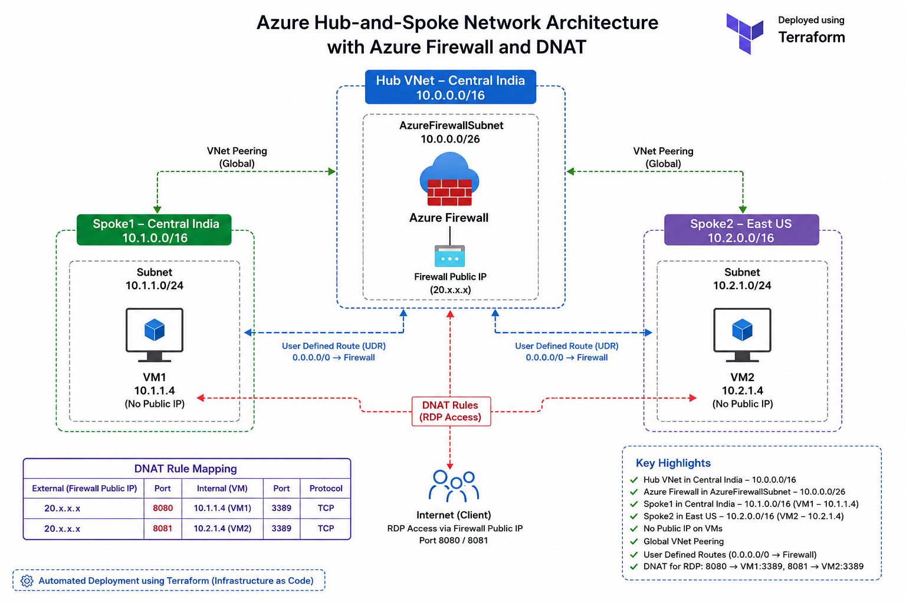

# Azure Multi-Region Hub-and-Spoke Network Architecture using Terraform


A production-style Azure Hub-and-Spoke network architecture deployed using **Terraform Infrastructure as Code (IaC)**.

This project demonstrates secure communication between multiple Azure Virtual Networks using Azure Firewall, Global VNet Peering, User Defined Routes (UDR), Network Security Groups (NSGs), and DNAT rules.

---

# Project Overview

This Terraform project provisions a secure Azure networking environment consisting of:

- Hub Virtual Network (Central India)
- Spoke1 Virtual Network (Central India)
- Spoke2 Virtual Network (East US)
- Azure Firewall
- Azure Firewall Policy
- Global VNet Peering
- User Defined Routes (UDR)
- Network Security Groups (NSG)
- Windows Server Virtual Machines
- DNAT Rules for Secure RDP Access
- No Public IP assigned to Virtual Machines

---

# Technologies Used

- Terraform
- Microsoft Azure
- Azure Firewall
- Azure Firewall Policy
- Azure Virtual Network
- Global VNet Peering
- Route Tables (UDR)
- Network Security Groups
- Windows Server 2025
- Azure Public IP
- Azure Resource Manager

---

# Architecture



---

# Network Topology

| Resource | Region | Address Space |
|-----------|---------|---------------|
| Hub VNet | Central India | 10.0.0.0/16 |
| AzureFirewallSubnet | Central India | 10.0.0.0/26 |
| Spoke1 VNet | Central India | 10.1.0.0/16 |
| Spoke1 Subnet | Central India | 10.1.1.0/24 |
| Spoke2 VNet | East US | 10.2.0.0/16 |
| Spoke2 Subnet | East US | 10.2.1.0/24 |

---

# Infrastructure Components

| Resource | Description |
|----------|-------------|
| Azure Firewall | Centralized traffic inspection |
| Firewall Policy | Network & DNAT Rules |
| Hub VNet | Shared Services Network |
| Spoke1 VNet | Workload Network (Central India) |
| Spoke2 VNet | Workload Network (East US) |
| Global VNet Peering | Private communication across regions |
| Route Tables | Force traffic through Firewall |
| Network Security Groups | Subnet Security |
| VM1 | Windows Server (Central India) |
| VM2 | Windows Server (East US) |

---

# Infrastructure Components

| Resource | Description |
|----------|-------------|
| Azure Firewall | Centralized traffic inspection |
| Firewall Policy | Network & DNAT Rules |
| Hub VNet | Shared Services Network |
| Spoke1 VNet | Workload Network (Central India) |
| Spoke2 VNet | Workload Network (East US) |
| Global VNet Peering | Private communication across regions |
| Route Tables | Force traffic through Firewall |
| Network Security Groups | Subnet Security |
| VM1 | Windows Server (Central India) |
| VM2 | Windows Server (East US) |

---
# Terraform File Structure

Azure-Hub-Spoke-Terraform
│
├── 01-versions.tf
├── 02-provider.tf
├── 03-variables.tf
├── 05-main.tf
├── 06-network.tf
├── 07-firewall.tf
├── 08-route-tables.tf
├── 09-security.tf
├── 10-virtual-machines.tf
├── 11-outputs.tf
├── README.md
```

# Deployment

## Initialize Terraform

```bash
terraform init
```

## Validate Configuration

```bash
terraform validate
```

## Format Terraform Files

```bash
terraform fmt -recursive
```

## Create Execution Plan

```bash
terraform plan
```

## Deploy Infrastructure

```bash
terraform apply
```

## Destroy Infrastructure

```bash
terraform destroy
```

---
# Azure Firewall Configuration

The Azure Firewall acts as the centralized security device in the Hub Virtual Network.

### Network Rules

| Rule            | Source      | Destination | Action |
|-----------------|-------------|-------------|--------|
| Spoke1 → Spoke2 | 10.1.1.0/24 | 10.2.1.0/24 | Allow  |
| Spoke2 → Spoke1 | 10.2.1.0/24 | 10.1.1.0/24 | Allow  |

### DNAT Rules

| Public Port | Destination VM | Private Port |
|-------------|----------------|--------------|
| 8080        | VM1            | 3389         |
| 8081        | VM2            | 3389         |

---
# User Defined Routes (UDR)

Each spoke subnet is associated with a custom route table.

Traffic between VNets is forced through Azure Firewall by configuring a default route pointing to the Firewall Private IP.

```
Spoke1
   ↓
Azure Firewall
   ↓
Spoke2
```

---
# Validation

The following tests were successfully completed.

- Azure Firewall deployed successfully
- Global VNet Peering established
- VM1 ↔ VM2 communication successful
- Azure Firewall DNAT working
- Test-NetConnection successful on Port 8080
- Test-NetConnection successful on Port 8081
- Terraform outputs verified
- No Public IP assigned to virtual machines

---
# Terraform Outputs

The project exports the following outputs.

- Hub VNet ID
- Spoke1 VNet ID
- Spoke2 VNet ID
- Firewall Name
- Firewall Public IP
- Firewall Private IP
- Firewall Policy ID
- Route Table IDs
- NSG IDs
- VM1 Private IP
- VM2 Private IP

---
# Cleanup

Destroy the complete infrastructure.

```bash
terraform destroy
```

---
# Author

**Adnan Khan**

Azure Administrator | Terraform | Azure Networking | Infrastructure as Code (IaC)

---


